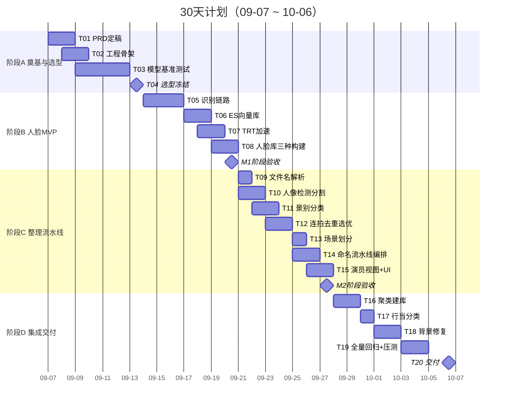

# 戏剧照片智能整理系统 · 30天实施计划（AI辅助开发版）
**一句话定义**：构建一个基于深度学习的戏剧照片整理 Web 系统——自动完成人脸识别、连拍去重、场景划分、规范命名，将摄影师生图目录整理为`{序号}-{日期}-{剧场}-{剧目}{事项} {场景}-{人物列表}-{摄影师}.jpg`的规范目录。
**计划总纲**：工期 30 天（2026-09-07 ~ 2026-10-06），4 个阶段 / 22 项任务；人类角色 = 架构师 + 验收者，AI = 代码实现者；每个任务以「可执行验收命令 + 量化门槛」闭环，PRD 为唯一需求真相源，scope 外功能一律拒绝。
---
## 〇、AI 协作总规范（先读这个，再执行任何任务）
本项目的最大风险不是写不出代码，而是**实现偏离需求**。因此设立五条铁律，贯穿全部 22 个任务：
| # | 铁律 | 执行方式 |
|---|------|---------|
| R1 | **PRD 即真相** | 本文档 + `docs/PRD.md` 是唯一需求来源。文档没写的功能 = 不做。执行中产生的任何“好想法”只能写入 `docs/backlog.md`，禁止直接实现 |
| R2 | **契约先行** | 接口签名（API 路由、函数签名、目录结构、config 键名）在实现前冻结（见 §2、§4）。AI 不得擅自更改契约；确需变更 → 提出 → 人工批准 → 更新 PRD → 再实现 |
| R3 | **验收测试先写** | 每个任务先写验收脚本（可独立运行、打印 PASS/FAIL），再写实现。测试不绿，任务不算完成 |
| R4 | **禁止静默降级** | 不得用 try/except 吞错误、不得用空实现/TODO 占位交付、不得改测试来让代码通过。发现前置依赖缺失 → 停下上报 |
| R5 | **每任务一 PR** | 一个任务一个分支一个 PR，描述中注明任务 ID。人工审查通过才合并——这是唯一的质量闸门 |
**任务卡模板**（每个任务开工前，按此格式生成指令交给 AI）：
```text
【任务ID】T-XX（对应本计划表）
【需求引用】PRD §N.N
【前置条件】已合并的 T-XX（可 import 的模块）
【任务目标】一句话，动词开头
【硬约束】必须使用的库/接口契约/禁止引入的依赖
【验收标准】可执行命令 + 期望输出（量化）
【禁止事项】本任务明确不做的事
【完成定义】验收命令全绿 + PR review 通过
```
---
## 一、范围冻结（防偏离的第一道闸门）
### 1.1 In-Scope（V1 必做）
| 域 | 功能 |
|----|------|
| 人脸 | 检测（含5关键点）→ 对齐 → 512维特征 → 向量检索；人脸库构建（半自动两轮 / 人工种子库 / 无标注聚类三种方式） |
| 整理 | 连拍分组去重+质量选优、景别分类（特写/近景/中景/全景）、EXIF时间场景划分、规范命名流水线、按演员视图 |
| 辅助 | 人像检测与分割、背景修复（人物移除+补全）、图像embedding检索/相似聚类、戏曲行当零样本分类（实验性） |
| 工程 | FastAPI REST + Web UI、任务进度查询、Docker部署、配置中心、日志 |
### 1.2 Out-of-Scope（V1 明确不做，AI 遇到即拒绝）
- ❌ 用户系统/登录/多租户/权限（单用户本地工具）
- ❌ 前端框架级单页应用（原生JS/轻模板即可，不引入 React/Vue 构建链）
- ❌ 模型训练/微调（全部使用预训练权重，只做推理）
- ❌ 跨机器分布式、云端部署、对象存储（单机GPU局域网）
- ❌ 数据库持久化用户数据（ES只存人脸向量，整理结果直接落文件系统）
- ❌ 移动端适配、国际化
### 1.3 已知产品边界（写进用户文档，不视为缺陷）
- 远景小脸（<40px）与净角黑脸谱检测率低 → 龙套不识别是**预期行为**
- 文件名人名用字不一致（如“齐乌利/齐乌力”）会在人脸库中拆为两个目录 → 提供人工合并手段即可
- 行当分类置信度 <0.4 时标 `uncertain`，**不写入文件名**
---
## 二、技术架构基线（冻结，AI 不得变更）
**运行形式**：B/S 局局域网部署——FastAPI 后端（纯API端口 8198）+ 同进程 Web UI（端口 8199），浏览器访问。不打包桌面端。
```
├── app/                      # 服务层（仅 main.py 路由 / server.py 生命周期 / server_ui.py UI）
├── core_modules/             # 算法模块，每个能力一个子包，模块间禁止横向 import
├── config/base.py            # 唯一参数中心：所有阈值/路径，支持 TRANS_* 环境变量覆盖
├── core_modules/tools/       # 共享工具（logger/image_io/face_quality/visualization）
├── tests/                    # 每任务验收脚本 test_*.py / 验收脚本 acceptance_*.py
├── docs/PRD.md               # 需求真相源（T01 产出）
├── docs/model_selection.md   # 选型报告（T04 产出）
├── weights/ data/ outputs/ logs/   # 不入库
└── Dockerfile docker-compose.yml environment.yml
```
**已冻结的工程决策**（AI 直接执行，不再讨论）：
| 决策点 | 结论 |
|--------|------|
| 服务框架 | FastAPI + Uvicorn，异步任务用后台 task + `/api/progress/{task_id}` 轮询 |
| 人脸向量库 | Elasticsearch 8.x，索引 `face_database_512`，512维 HNSW |
| 图搜向量索引 | faiss（内存索引） |
| 推理加速 | TensorRT FP16，`device` 参数四选一：`tensorrt` / `tensorrt:N` / `cuda` / `cpu`，TRT 不可用自动回退 |
| 识别缩放策略 | 链路固定缩至最长边 1920（精度不变、解码快~2.2x）；**禁止降到 960**（小脸相似度掉 ~0.1） |
| 图片识别阈值 | `known_threshold=0.55`（ArcFace 余弦） |
| 日志 | 统一 logger（北京时区、按天滚动、StepTimer 计时） |
| 临时文件 | `outputs/temp/` 超 1 小时自动清理 |
| GPU | 需 NVIDIA GPU；无 GPU 回退 CPU（仅调试用，性能不达标不算缺陷） |
---
## 三、30 天甘特图与任务总表

### 任务总表（22项，每项含 DoD 验收命令）
> **角色**：H=人类（架构/审查），AI=编码代理。验收命令在合并前必须由人类实际执行一次。
| ID | 任务 | 起止 | 执行者 | 验收标准（DoD） |
|----|------|------|--------|----------------|
| **阶段A：奠基与选型（09-07~09-13）** |
| T01 | 编写 `docs/PRD.md`：功能清单、API 契约表、命名模板、验收指标 | 09-07~09-08 | H+AI | 人工逐条确认，PRD 覆盖 §1.1 全部功能；此后 PRD 只增不改（改动走 R2 流程） |
| T02 | 工程骨架：目录结构、`config/base.py`、logger、image_io、Dockerfile、环境文件锁版 | 09-08~09-09 | AI | `python -c "from core_modules.tools.logger import get_logger"` 通过；`docker compose build` 成功；config 支持 `TRANS_*` 环境变量覆盖的单测通过 |
| T03 | 模型基准测试（见 §4 候选池协议）：每能力维度跑候选模型，产出对比数据 | 09-09~09-12 | AI | `docs/model_selection.md` 生成，含每个维度的**精度+速度+许可**三列对比表与原始数据 |
| T04 | 选型定稿 + 接口契约冻结（各模块主类签名、API 路由表） | 09-12~09-13 | **H（关键决策）** | 人工签字确认选型表；`docs/PRD.md` 附最终 API 契约，后续任务按契约实现 |
| **阶段B：人脸识别 MVP（09-14~09-20）** |
| T05 | 人脸识别链路：检测（含5点）→ ArcFace 标准对齐112×112 → 512维特征 → 余弦匹配 | 09-14~09-16 | AI | `python tests/test_face_pipeline.py` 绿灯：同人样本对余弦 ≥0.5、异人对 <0.3，样本各≥20对；单图端到端 CUDA ≤200ms（RTX3090级别） |
| T06 | ES 向量库：索引创建/写入/检索，`face_database_512` | 09-17~09-18 | AI | `test_es_database.py`：写入100条→检索top1 命中率100%；ES 不可连时 API 返回明确错误码而非崩溃 |
| T07 | TensorRT FP16：引擎构建+缓存（`trt_cache/`）、四档 device 参数、自动回退 | 09-18~09-19 | AI | `test_trt.py`：TRT vs CUDA 特征余弦 >0.999（一致性）；缓存命中后加载 <2s；`device='cpu'` 可回退 |
| T08 | 人脸库三种构建：①半自动两轮（单人归属→多人锚定传播，同人强校验<0.35拦截、每人≤8锚定）②人工种子库 ③`/api/face/build_database` | 09-19~09-20 | AI | `test_face_db_build.py`：构造含“X饰Y”标注的样本目录→库目录与人物数正确；注入1张异人冲突样本→被强校验拦截；谢幕合影自动跳过 |
| **M1 检查点（09-20，人工 30 分钟）**：`curl` 调 `/api/face/recognize` 识别真实剧照，眼验识别框+姓名；不达标不进阶段C |
| **阶段C：智能整理流水线（09-21~09-27）** |
| T09 | 文件名/目录名解析：提取日期/剧场/剧目/人物/摄影师/连拍号（无模型依赖） | 09-21 | AI | `test_filename_parser.py`：≥30 个构造用例全对，含"X（饰Y）"、多演员逗号、无标注等边界 |
| T10 | 人像检测（person box + mask） | 09-21~09-22 | AI | `test_person_det.py`：样本图 person 检出率 ≥95%（正常构图人物） |
| T11 | 景别分类：特写/近景/中景/全景四分类 | 09-22~09-23 | AI | `test_shot_classify.py`：人工标注 ≥100 张景别 GT → 准确率 ≥85% |
| T12 | 连拍去重选优：连拍号/时间+embedding 分组 → 全图质量评分 → 景别感知 top-K 保留 | 09-23~09-24 | AI | `test_burst_dedup.py`：构造 79 张连拍样本 → 保留数=top-K×景别桶数，可配置；被保留图的平均质量分 > 被丢弃图 |
| T13 | 场景划分：EXIF 时间分段为主 + embedding 聚类为辅；输出 `scene-01…` 占位 + 支持 JSON 人工映射 | 09-25 | AI | `test_scene_split.py`：构造跨3场景时间序列 → 划分3段；映射 JSON 传入后标签替换正确 |
| T14 | 整理流水线编排：去重→识别→（行当占位）→场景→规范命名，输出 `organized/` + `organize_report.json`（每图：来源/保留丢弃/人物/场景） | 09-25~09-26 | AI | `test_smart_organize.py`：端到端跑样本目录 → 输出命名 100% 符合模板正则；report 字段完整；总张数 = 保留+丢弃 |
| T15 | 演员视图 + `/organize` Web UI 四卡片 | 09-26~09-27 | AI | UI 可走通“建库→流水线→视图”；限定演员（模糊人名/多人逗号/留空全库）过滤正确；人名未命中时列库内人物名提示 |
| **M2 检查点（09-27，人工 1 小时）**：用一份真实摄影目录完整走 UI 四卡片，眼验输出目录命名与 report |
| **阶段D：进阶功能与交付（09-28~10-06）** |
| T16 | 无标注聚类建库：人脸聚类（后台任务+进度轮询）→ 簇预览拼图 → 命名入库/忽略 | 09-28~09-29 | AI | `test_face_cluster.py`：构造已知 GT 的无标注目录 → 高置信簇（内聚度≥0.5且≥3脸）纯度 ≥0.9；API 扫描/结果/命名/忽略四端点联测通过 |
| T17 | 行当分类：zero-shot（生旦净丑），置信度<0.4 标 uncertain 不入文件名 | 09-30 | AI | `test_role_classify.py`：样本集准确率报告产出（基线目标 ≥70%）；低置信样本确实不写入命名 |
| T18 | 背景修复：人物移除 + LAMA 补全 | 10-01~10-02 | AI | `test_inpaint.py`：移除指定人物后 mask 区域 LPIPS 优于“直接糊均值”基线；输出 2k 分辨率无明显伪影 |
| T19 | 全量回归 + 性能压测 + Swagger 核对 | 10-03~10-04 | AI+H | `run_all_tests.sh` 全绿（tests/ 下全部脚本）；并发 10 路 `/api/face/recognize` 30min 错误率 <0.1%；`/docs` 端点与 PRD 契约表逐条一致 |
| T20 | 部署验证 + 用户手册 + 交付演示 | 10-05~10-06 | H+AI | `docker compose up` 全新机器冷启动成功（权重 volume 挂载）；README 快速开始 5 步内可复现；验收报告签字 |
> **缓冲说明**：T17/T18 为 P1 功能，若 T16 超期可整体后移至交付后 V1.1，不影响 V1 闭环（见 §5 优先级）。
---
## 四、模型候选池与选型测试协议（T03-T04 核心内容）
**原则**：每个能力维度准备 2~4 个候选，参考模型 + 同类替代，统一基准测试后由**人工**定稿。测试脚本模板统一：同一份测试图集、同一硬件、输出精度/速度/许可三列。
### 4.1 候选池
| 能力 | 参考首选 | 候选2 | 候选3 | 评测指标 | 许可注意 |
|------|---------|-------|-------|---------|---------|
| 人脸检测 | **SCRFD 10G**（含5关键点） | SCRFD 500M（轻量） | RetinaFace (MobileNet0.25) | mAP、<40px小脸召回、ms/图 | SCRFD/RetinaFace 权重多为非商用许可，内部使用 OK |
| 人脸特征 | **ArcFace Glint100**（512维） | AdaFace | MagFace | 同人/异人余弦分布分离度、LFW类准确率 | 同上 |
| 人像检测 | **RTDETR-X** | RTDETR-R50 | YOLO11x-det（person类） | person mAP、ms/图 | YOLO 系 AGPL，对外商用需企业授权 |
| 人像分割 | **YOLO11x-seg** | YOLO11l-seg | SAM2（prompt式，重） | mask IoU、边缘质量、ms/图 | SAM2 Apache 2.0 友好 |
| 景别分类 | **YOLO11l-pose**（关键点推景别） | YOLOv8l-pose | RTMPose | 景别四分类准确率、ms/图 | YOLO/v8 同 AGPL |
| 背景修复 | **LAMA（FFT版）** | LaMa big | MAT | LPIPS/FID、2k图效果、显存 | LAMA Apache 2.0 ✅ |
| 检索embedding | **DINOv2 ViT-B** | **SigLIP2** | ResNet50 | 检索 recall@10、聚类可用性 | 均 MIT/Apache 友好 |
| 行当分类 | **SigLIP2 zero-shot** | CLIP zero-shot | —（不训练） | 样本集准确率、置信度分布 | 友好 |
### 4.2 选型决策规则（写死，避免主观）
1. **一票否决**：候选在本项目测试集上精度低于参考首选 **10% 以上** → 排除
2. 精度差距 <2% 时，**速度优先**（吞吐翻倍 > 精度微升）
3. 精度速度相近时，**许可优先**（Apache/MIT > 非商用）
4. 测试集固定：每维度 ≥200 张戏剧照片（含小脸、黑脸谱、多人大合影、连拍、逆光），**测试集与验收集分离**
5. 结果落 `docs/model_selection.md`，人工签字后写回 PRD §选型表，即冻结
---
## 五、功能清单与优先级（P0 不闭环则 V1 不交付）
| 功能 | 优先级 | 依赖 | V1 验收量化门槛 |
|------|--------|------|----------------|
| 人脸识别（检测/对齐/特征/匹配） | **P0** | T05 | 正常脸识别准确率 ≥95%；异人误识率 <2% |
| ES 向量库 | **P0** | T06 | top1 检索命中率 100% |
| TRT FP16 加速 | **P0** | T07 | 与 CUDA 特征余弦 >0.999；缓存加载 <2s |
| 人脸库三种构建 | **P0** | T08 | 异人混入 = 0（强校验拦截） |
| 连拍去重选优 | **P0** | T11,T12 | top-K 可配置；保留图质量分均值 > 丢弃图 |
| 规范命名流水线 | **P0** | T09~T14 | 命名 100% 符合模板；report 字段 100% 填充 |
| 演员视图 | **P0** | T15 | 限定演员过滤准确 |
| Web UI 四卡片 | **P0** | T15 | 走通主流程 |
| 无标注聚类建库 | P1 | T16 | 高置信簇纯度 ≥0.9 |
| 行当分类 | P1 | T17 | ≥70%，低置信不入名 |
| 背景修复 | P1 | T18 | LPIPS 优于基线 |
| 图搜/相似聚类 | P2 | — | V1.1 |
| Docker 交付 | **P0** | T20 | 冷启动成功 |
**迭代计划**：V1.1（交付后2周）= P1 项打磨 + 图像检索；V1.2 = 批量多剧目、性能优化；V2.0 = 桌面端评估、向量库规模化（>百万时评估 Milvus 替换 ES）。
---
## 六、测试与质量闭环（三层四关口）
```
单元验收（每任务 test_*.py，AI先写）→ PR审查（人工）→ 阶段检查点（M1/M2 人工眼验真实数据）→ 交付验收（acceptance 脚本 + 指标表）
```
**最终交付验收单**（10-06 签字表）：
| 指标 | 目标 | 验证命令 |
|------|------|---------|
| 识别准确率 | ≥95%（排除<40px小脸） | `acceptance_face.py`，标注 GT 集 |
| 误识率 | <2% | 同上 |
| 单图端到端 | ≤200ms（TRT, 1920缩放） | `test_trt.py` 基准 |
| 命名合规率 | 100% | `acceptance_organize.py` 正则校验 |
| 聚类纯度 | ≥0.9（高置信簇） | `test_face_cluster.py` |
| API 错误率 | <0.1%（30min 并发10） | `test_server_load.py` |
| 全量回归 | 全绿 | `run_all_tests.sh` |
| 冷启动 | Docker 全新环境可跑 | 人工执行 |
---
## 七、UI 设计基线
- **风格**：深色专业工作台（摄影后期工具调性），中高信息密度
- **配色**：背景 `#1E293B`/`#0F172A`，卡片 `#334155`，主文字 `#F1F5F9`/次级 `#94A3B8`，**强调色暖橙 `#F97316`**（主按钮/进度/选中），成功 `#22C55E`、警告 `#EAB308`（uncertain 行当）、错误 `#EF4444`
- **布局**：`/organize` 页 = 四卡片纵向排列（①建人脸库→②演员视图→③整理流水线→④聚类建库），箭头示意推荐顺序；每卡片含表单+按钮+后台任务进度条（轮询 progress API）
- **约束**：原生 JS + 模板渲染即可，不引入前端构建链（§1.2）
---
## 八、风险与应对
| 风险 | 概率 | 应对 |
|------|------|------|
| AI 实现偏离 PRD | 高 | R1~R5 铁律 + 契约冻结 + 每PR人工审查 |
| 候选模型精度不达参考水平 | 中 | 参考模型为保底，选型协议第1条只淘汰劣于它10%的候选 |
| YOLO/InsightFace 许可限制（若商用） | 低 | 内部使用合规；商业化前换 Apache/MIT 权重或购授权（选型协议第3条已考虑） |
| GPU/TRT 环境故障 | 中 | device 四档回退机制；环境问题人工介入，AI 不自行绕过 |
| 30 天工期 | 中 | P1（T17/T18）可裁剪到 V1.1；P0 链路最短路径 T01→T15 已留缓冲 |
**总执行逻辑**：先冻结范围和契约（阶段A）→ 量化选型（人工签字）→ 每任务“验收测试先行”闭环（阶段B/C）→ 人工检查点拦截偏差（M1/M2）→ 交付验收单签字（M3）。任何一步不绿，不进入下一步——这就是本计划的可验收闭环。
